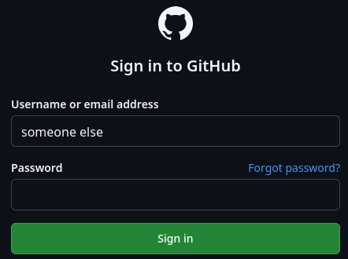

# pass-type

Type passwords or any other text from your [pass](https://www.passwordstore.org/) password store using [XDG Desktop Portal](https://flatpak.github.io/xdg-desktop-portal/).



Tested to work on KDE Plasma and GNOME natively. Works on wlroots based compositors like Sway with [waycrate/xdg-desktop-portal-luminous](https://github.com/waycrate/xdg-desktop-portal-luminous).

## Usage

Install `pass-type.bash` as an extension and make sure `pass-type.py` is in your $PATH.
Create a global hotkey for your desktop environment to execute `pass type`.

The default extension script starts the typing script in listening mode in the background which stays running until the session is closed. This means that once you accept the remote desktop connection once, you don't need to do it again until you logout or kill the remote desktop session by hand.

For debugging and testing, you can always run `pass-type.py` directly. It expects input from stdin to type with a default sequence of the first line.

```
usage: pass-type.py [-h] [-s SEQUENCE] [-l] [-c] [--socket-path SOCKET_PATH] [--lock-path LOCK_PATH] [--start-delay START_DELAY] [--typing-delay TYPING_DELAY]

Type passwords or other text with XDG Desktop Portal

options:
  -h, --help            show this help message and exit
  -s, --sequence SEQUENCE
                        Sequence to type from stdin (default: {0})
  -l, --listen          Run as a server to listen for commands (default: False)
  -c, --connect         Connect to a server to send commands to (default: False)
  --socket-path SOCKET_PATH
                        Socket path for listen or connect (default: $XDG_RUNTIME_DIR/passtype.sock)
  --lock-path LOCK_PATH
                        Lock path for listening (default: $XDG_RUNTIME_DIR/passtype.lock)
  --start-delay START_DELAY
                        Delay in milliseconds before sequence starts (default: 500)
  --typing-delay TYPING_DELAY
                        Delay in milliseconds between keypresses (default: 25)
```

## Dependencies

 - Python 3.13+
 - jeepney (Debian/Ubuntu: `apt install python3-jeepney`)
 - bemenu (or any other menu tool)
 - a working implementation of org.freedesktop.portal.RemoteDesktop

This is intentionally pure Python and doesn't depend on any native code, not even libxkbcommon.

## Sequence syntax

Sequences are space separated strings of raw and entry keys.
Entry keys are enclosed in curly brackets while raw keys are as-is and may be combined with `+` to hold them together.

In your pass entry, the first line is aliased to `{Password}` in a sequence.
Each line starting from the first (0) can be indexed as a whole using `{n}`.
For each `key: value` pair in additional lines of the entry the key can be addressed as `{key}`.

For every key that has the name "Auto-Type", its value will be added as a typeable sequence in the second modal when using the default extension.

To include key combinations in the sequence, most [XKB compatible](https://github.com/xkbcommon/libxkbcommon/blob/master/include/xkbcommon/xkbcommon-keysyms.h) names of special keys found on your keyboard without the `XKB_KEY_` prefix can be used and combined together with `+`.
There is no distinction between modifier keys and regular keys so if you combine regular keys it's like you literally hold them down.
For convenience, the following additional names are aliased: `Enter`, `Shift` and `Ctrl/Control`.

Demo video entry contents:
```
$ pass show GitHub
XXXXXXXXXXXXXXXXXXXXXXXXX
Username: gh-username
Auto-Type: Control+a Delete {Username} Tab {Password}
```

For typing raw characters from the entries, only Latin 1 is supported as it maps neatly to Unicode and XKB.

## Security considerations

The remote desktop portal and portals in general use the user session DBus as the communication mechanism.
It means that any process running as the same user as the portal can eavesdrop on every key sent through it or any process could claim to be the portal itself and receive the input directly.
In general this isn't a problem because the session bus is only accessible by the logged in user or by root so if you use this on your personal computer which only you have root access to no one else should be able to access it.

Given how `pass` itself works, your GPG may be unlocked in the GPG agent to access the secrets themselves so if anyone has access to your session DBus they likely also have access to your GPG agent and have the ability to decrypt your secrets directly anyway.

This script itself has very little error checking or validation so technically the listening socket can be abused to mess with you by sending random keypresses if anyone gains access to it but it's protected with file permissions by default so about the same as DBus, caveat emptor.

# Future work

- Add priming mode where you can first "prime" your input and sequence into the listening script (with timeout) and later use a hotkey to execute it
- Pick entries directly with `pass type <entry>` instead of going through a menu for priming, this allows terminal-only usage with clear intention when to execute instead of using a start delay
- Add a timeout to listening mode so the script will exit automatically after configured time from the last execution
- Remember last selected entry for N seconds after executing through a menu to allow reusing different keys from the same entry in succession without searching for it every time
- Ability to inject custom delays in the sequence, haven't decided on the syntax yet other than using `[]` to encapsulate
